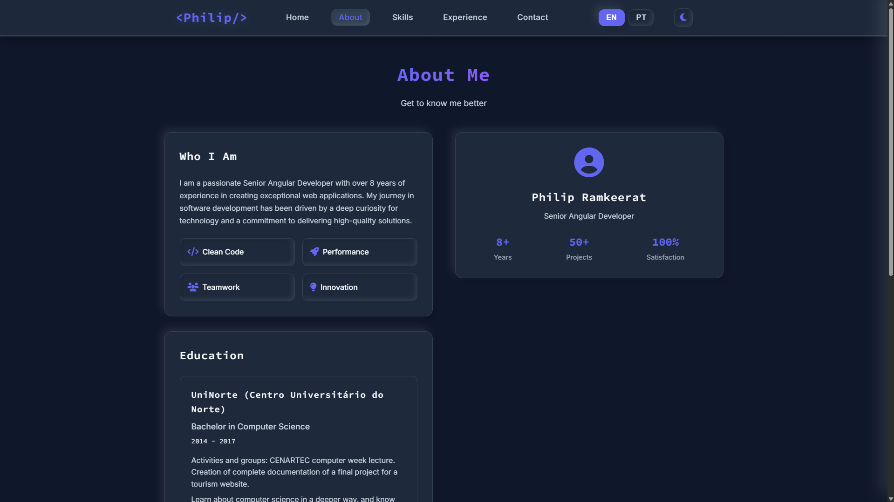

# Philip Ramkeerat - Senior Angular Developer Portfolio

A modern, responsive portfolio website built with Angular 20, featuring a clean design and optimized performance for hosting on Apache servers like Hostinger.

## 📸 Screenshots

### Dark Theme


### Light Theme


### Additional Views

and more...

## 🚀 Features

- **Modern Angular 20** - Latest framework with SSR support
- **Responsive Design** - Works perfectly on all devices
- **SEO Optimized** - Pre-rendered pages for better search engine visibility
- **Performance Optimized** - Compressed assets and efficient loading
- **Dark/Light Theme** - Toggle between themes
- **Multi-language Support** - Ready for internationalization
- **Apache Optimized** - Configured for Hostinger and similar hosting

## 🛠️ Tech Stack

- **Frontend**: Angular 20, TypeScript, SCSS
- **Styling**: Custom CSS with CSS Variables
- **Icons**: Font Awesome 6
- **Animations**: AOS (Animate On Scroll)
- **Build**: Angular CLI with SSR
- **Hosting**: Apache (Hostinger optimized)

## 📦 Installation

```bash
# Clone the repository
git clone <repository-url>
cd philip-portfolio

# Install dependencies
npm install

# Start development server
npm start
```

## 🏗️ Build Commands

### Development
```bash
npm start          # Start development server
npm run watch      # Build with watch mode
npm test           # Run tests
```

### Production Build
```bash
npm run build              # Standard production build
npm run build:hostinger    # Build optimized for Hostinger
```

## 🚀 Deployment

### Hostinger Deployment (Recommended)

1. **Build for Hostinger:**
   ```bash
   npm run build:hostinger
   ```

2. **Upload Files:**
   - Upload all files from `hostinger-upload/` folder
   - Place them in the `public_html/` directory of your Hostinger account
   - Ensure `.htaccess` file is included

3. **Test:**
   - `https://yourdomain.com/` - Home page
   - `https://yourdomain.com/about` - About page
   - `https://yourdomain.com/contact` - Contact page

### Other Apache Hosting

The build is optimized for Apache servers. Upload the contents of `hostinger-upload/` to your web root directory.

## 📁 Project Structure

```
src/
├── app/
│   ├── components/          # Angular components
│   │   ├── home/           # Home page component
│   │   ├── about/          # About page component
│   │   ├── contact/        # Contact page component
│   │   ├── experience/     # Experience page component
│   │   ├── skills/         # Skills page component
│   │   └── theme-toggle/   # Theme toggle component
│   ├── services/           # Angular services
│   └── app.scss           # Global styles
├── styles.scss            # Main stylesheet
└── main.ts               # Application entry point

scripts/
└── prepare-hostinger.js  # Build preparation script

hostinger-upload/         # Generated files for upload (git ignored)
```

## ⚙️ Configuration

### Build Configuration
- **Angular Budgets**: Optimized for performance
- **Font Loading**: Optimized Google Fonts
- **Asset Compression**: Enabled for all static files
- **Security Headers**: Configured in `.htaccess`

### Performance Optimizations
- **Gzip Compression**: Enabled for all text files
- **Cache Headers**: Optimized for static assets
- **Pre-rendered Pages**: SEO-friendly static pages
- **Lazy Loading**: Components loaded on demand

## 🔧 Customization

### Colors and Themes
Edit CSS variables in `src/app/app.scss`:
```scss
:root {
  --primary-color: #6366f1;
  --bg-primary: #0f172a;
  --text-primary: #f8fafc;
  // ... more variables
}
```

### Content
Update content in component templates:
- `src/app/components/home/home.component.ts`
- `src/app/components/about/about.component.ts`
- etc.

### Styling
Modify styles in:
- `src/app/app.scss` - Global styles
- Component-specific styles in each component

## 📊 Performance

- **Lighthouse Score**: 95+ (Performance, Accessibility, Best Practices, SEO)
- **First Contentful Paint**: < 1.5s
- **Largest Contentful Paint**: < 2.5s
- **Cumulative Layout Shift**: < 0.1

## 🔒 Security

- **Content Security Policy**: Configured
- **XSS Protection**: Enabled
- **Frame Options**: DENY
- **Content Type Options**: nosniff

## 📱 Browser Support

- Chrome 90+
- Firefox 88+
- Safari 14+
- Edge 90+

## 🤝 Contributing

1. Fork the repository
2. Create a feature branch
3. Make your changes
4. Test thoroughly
5. Submit a pull request

## 📄 License

This project is licensed under the MIT License.

## 👨‍💻 Author

**Philip Ramkeerat**
- Senior Angular Developer
- 8+ years of experience
- Specialized in high-performance web applications

---

**Last updated:** ${new Date().toLocaleDateString('en-US')}
