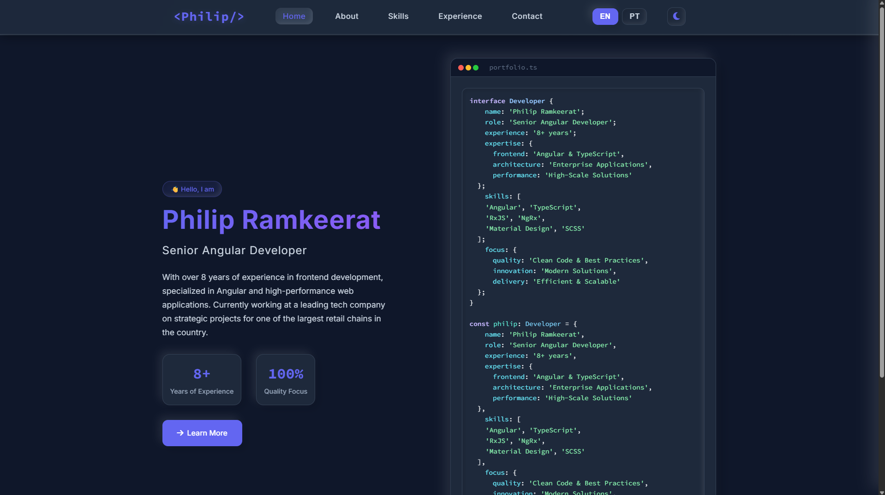
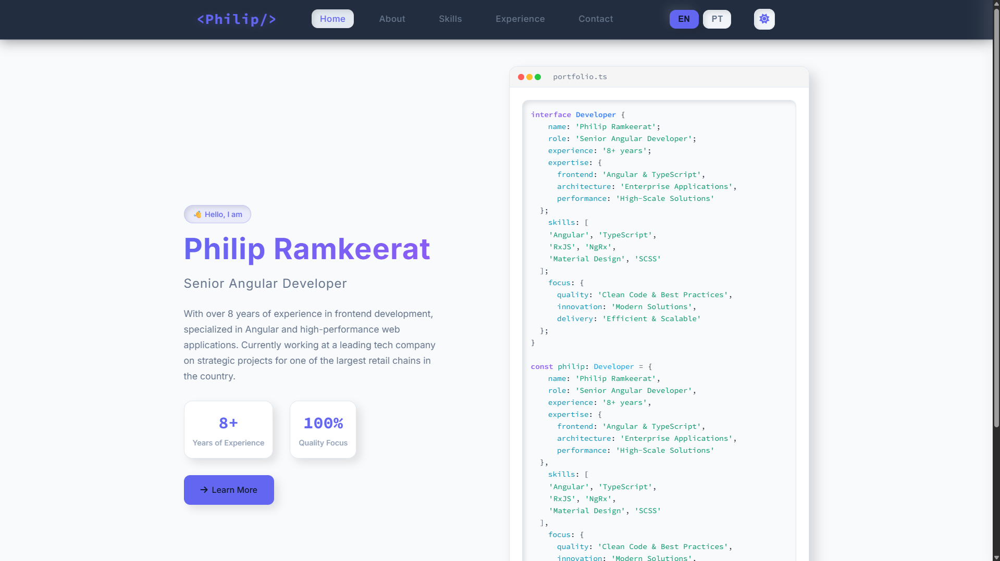

<div align="center">
  <h1 align="center">Philip Ramkeerat - Senior Angular Developer Portfolio</h1>
  <p align="center">
    A modern, responsive, and feature-rich portfolio website built with Angular, showcasing projects, skills, and professional experience.
  </p>
</div>

<!-- Badges -->
<p align="center">
  
  
  
  
</p>

<div align="center">
  <a href="https://philipramkeerat.com.br/home" target="_blank"><strong>➥ Visit the Live Demo »</strong></a>
</div>

<br>

---

## 📸 Screenshots

### Dark Theme


### Light Theme


---

## 📚 Table of Contents
- [About The Project](#about-the-project)
- [Tech Stack](#-tech-stack)
- [Features](#-features)
- [Getting Started](#-getting-started)
  - [Prerequisites](#prerequisites)
  - [Installation](#installation)
- [Usage](#-usage)
- [Building the Project](#-building-the-project)
- [Deployment](#-deployment)
- [Project Structure](#-project-structure)
- [Customization](#-customization)
- [Performance](#-performance)
- [Security](#-security)
- [Contributing](#-contributing)
- [License](#-license)
- [Contact](#-contact)


---

## 🎯 About The Project

This project is a personal portfolio website designed to showcase my skills and experience as a Senior Angular Developer. It's built with modern web technologies and best practices, focusing on performance, SEO, and user experience.

The portfolio features sections for my professional experience, technical skills, a contact form, and a theme switcher for light and dark modes.

---

## 🛠️ Tech Stack

This project is built with a modern frontend stack:

*   **[Angular](https://angular.io/):** A powerful framework for building dynamic web apps.
*   **[TypeScript](https://www.typescriptlang.org/):** A typed superset of JavaScript that compiles to plain JavaScript.
*   **[SCSS](https://sass-lang.com/):** A CSS preprocessor with more features than plain CSS.
*   **[RxJS](https://rxjs.dev/):** A library for reactive programming using Observables.
*   **[Express.js](https://expressjs.com/):** Used for server-side rendering (SSR) with Angular Universal.
*   **[AOS](https://michalsnik.github.io/aos/):** Animate On Scroll library for animations.

---

## ✨ Features

-   **Modern UI/UX:** Clean, modern design with a great user experience.
-   **Responsive Design:** Fully responsive and works on all devices, from mobile to desktop.
-   **Server-Side Rendering (SSR):** With Angular Universal for better performance and SEO.
-   **Dark/Light Theme:** A theme switcher to toggle between dark and light modes.
-   **SEO Optimized:** Meta tags and structured data for better search engine visibility.
-   **Performance Optimized:** Optimized for fast loading times.
-   **Multi-language Support (i18n):** Ready for internationalization.

---

## 🚀 Getting Started

To get a local copy up and running, follow these simple steps.

### Prerequisites

Make sure you have the following installed on your machine:

*   **Node.js:** [Download and install Node.js](https://nodejs.org/) (which includes npm).
*   **Angular CLI:** Install the Angular CLI globally by running:
    ```sh
    npm install -g @angular/cli
    ```

### Installation

1.  **Clone the repository:**
    ```sh
    git clone https://github.com/your-username/philip-portfolio.git
    ```
2.  **Navigate to the project directory:**
    ```sh
    cd philip-portfolio
    ```
3.  **Install NPM packages:**
    ```sh
    npm install
    ```

---

## 💻 Usage

To run the project in development mode, use the following command. This will start a local development server.

```sh
npm start
```

Open your browser and navigate to `http://localhost:4200/`. The app will automatically reload if you change any of the source files.

---

## 🏗️ Building the Project

To create a production-ready build of the application, run the following command:

```sh
npm run build
```

This command will compile the application and output the production-ready files to the `dist/philip-portfolio` directory. This includes both browser and server builds for SSR.

---

## 🚢 Deployment

This project includes a custom script to prepare the application for deployment on an Apache server like Hostinger.

To create a deployment-ready package, run:
```bash
npm run build:hostinger
```

This command does the following:
1.  Runs the standard `npm run build` command.
2.  Executes the `scripts/prepare-hostinger.js` script which:
    *   Copies the necessary build artifacts to the `hostinger-upload` directory.
    *   Creates a custom `.htaccess` file with rules for routing, caching, and security.
    *   Generates a `HOSTINGER-INSTRUCTIONS.md` with deployment steps.

To deploy the application, upload the contents of the `hostinger-upload` directory to the `public_html` folder of your web server.

**Note:** The `prepare-hostinger.js` script currently relies on hardcoded file names for JS/CSS assets. For more robust deployments, consider modifying this script to dynamically read the filenames from the build output.

---

## 📁 Project Structure

```
philip-portfolio/
├── src/
│   ├── app/
│   │   ├── components/      # Reusable components (About, Contact, etc.)
│   │   ├── services/        # Services (ThemeService, etc.)
│   │   ├── app.config.ts    # Application configuration
│   │   ├── app.routes.ts    # Main application routes
│   │   └── app.component.ts # Root component
│   ├── assets/              # Images, fonts, and other static assets
│   ├── environments/        # Environment-specific settings
│   ├── styles.scss          # Global styles
│   └── main.ts              # Main entry point of the application
├── scripts/
│   └── prepare-hostinger.js # Prepares build for Hostinger deployment
├── hostinger-upload/        # Generated files for upload (git ignored)
├── angular.json             # Angular CLI configuration
└── package.json             # Project dependencies and scripts
```

---

## 🔧 Customization

### Colors and Themes
You can easily customize the color scheme and theme of the application by editing the CSS variables in `src/app/app.scss`:

```scss
/* Example theme variables in src/app/app.scss */
:root {
  --primary-color: #6366f1;
  --bg-primary: #0f172a;
  --text-primary: #f8fafc;
  /* ... and more ... */
}
```

### Content
All content is managed within the Angular components located in `src/app/components/`. You can update the text, images, and other content by editing the HTML templates and TypeScript files in each component's directory.

---

## 📊 Performance

This project is highly optimized for performance, achieving excellent Lighthouse scores. Key performance features include:

-   **Gzip Compression:** Enabled for all text-based files via the `.htaccess` configuration.
-   **Cache Headers:** Optimized cache control for static assets to reduce load times for returning visitors.
-   **Pre-rendered Pages:** SSR ensures fast initial page loads and improved SEO.
-   **Lazy Loading:** Feature modules can be configured to load on demand.

---

## 🔒 Security

The application includes several security measures to protect against common web vulnerabilities:

-   **Content Security Policy (CSP):** Helps prevent XSS attacks.
-   **X-Content-Type-Options:** Prevents MIME-sniffing.
-   **X-Frame-Options:** Protects against clickjacking.
-   **X-XSS-Protection:** Enables the cross-site scripting (XSS) filter in browsers.

These headers are configured in the `.htaccess` file generated by the deployment script.

---

## 🤝 Contributing

Contributions are what make the open-source community such an amazing place to learn, inspire, and create. Any contributions you make are **greatly appreciated**.

If you have a suggestion that would make this better, please fork the repo and create a pull request. You can also simply open an issue with the tag "enhancement".

1.  Fork the Project
2.  Create your Feature Branch (`git checkout -b feature/AmazingFeature`)
3.  Commit your Changes (`git commit -m 'Add some AmazingFeature'`)
4.  Push to the Branch (`git push origin feature/AmazingFeature`)
5.  Open a Pull Request

---

## 📄 License

Distributed under the MIT License. See `LICENSE` for more information.

---

## 📧 Contact

Philip Ramkeerat - [philip_ramkeerat@hotmail.com](mailto:philip_ramkeerat@hotmail.com)

Project Link: [https://github.com/philip-ramkeerat/philip-portfolio](https://github.com/philip-ramkeerat/philip-portfolio)

<p align="center">
  <a href="https://www.linkedin.com/in/philip-ramkeerat/">
    
  </a>
</p>
